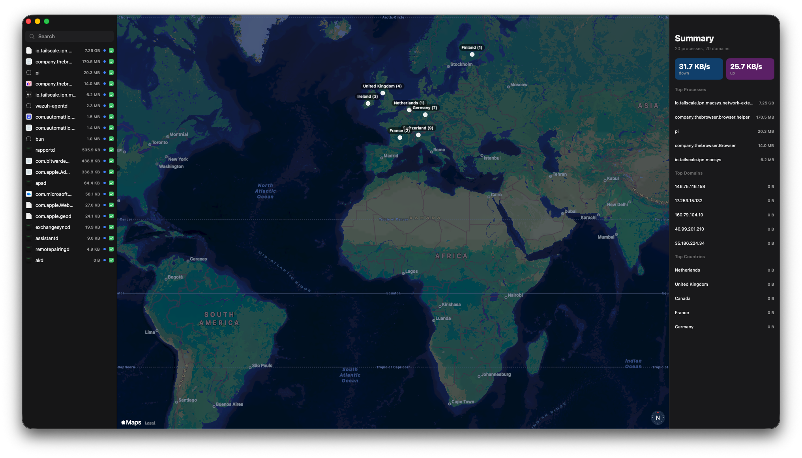
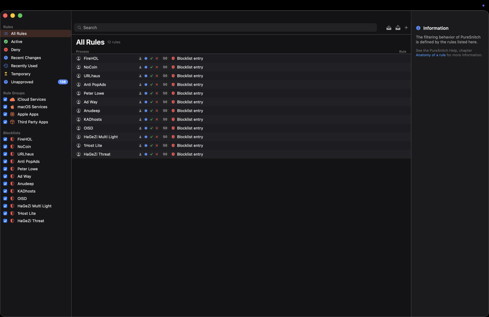

<p align="center">
  
</p>

<p align="center">
  <b>English</b> |
  <a href="docs/README.ar.md">العربية</a> |
  <a href="docs/README.es.md">Español</a> |
  <a href="docs/README.ja.md">日本語</a> |
  <a href="docs/README.zh-Hans.md">简体中文</a> |
  <a href="docs/README.zh-Hant.md">繁體中文</a>
</p>

<h1 align="center">FreeSnitch</h1>

<p align="center">
  <b>See what your Mac is talking to. Block what you don't trust.</b><br>
  Free, open-source application firewall for macOS. No subscription, no telemetry, no upsell.
</p>

<p align="center">
  
  
  
  <a href="LICENSE"></a>
  <a href="https://github.com/isaaclins/freesnitch/stargazers"></a>
</p>

<p align="center">
  <a href="#install">Install</a> -
  <a href="#why-this-exists">Why this exists</a> -
  <a href="#what-it-does">What it does</a> -
  <a href="#how-it-works">How it works</a> -
  <a href="#permissions">Permissions</a> -
  <a href="#screenshots">Screenshots</a> -
  <a href="#contributing">Contributing</a>
</p>

---

## Install

No public release or Homebrew cask is available yet. Build from source for now.

Two builds exist. The difference is about who can build them, not about which one is the real product. Every release built by `Scripts/release.sh` is the firewall build, so that is what a user installs. The monitor build exists so contributors can work on the app without holding this team's Developer ID provisioning profiles.

### Firewall build, the one that ships

Generated from `project-netext.yml`. It embeds `io.isaaclins.freesnitch.netext.systemextension` and provides per-process filtering. It requires the Developer ID provisioning profiles for the app and extension in `Profiles/`, plus Developer ID signing.

```bash
xcodegen generate --spec project-netext.yml
xcodebuild -project FreeSnitch.xcodeproj -scheme FreeSnitch -configuration Release \
  -derivedDataPath build build
```

Install the signed firewall build in `/Applications`. On first launch, approve the system extension in **System Settings > Privacy & Security**.

### Monitor build, for contributors without the profiles

Generated from `project.yml`. It includes the app, helper, monitoring, rules UI, DNS proxy, and `pfctl` integration, and omits the Network System Extension so it builds without provisioning profiles. Use it to work on everything except per-process filtering. It is not what users receive.

```bash
brew install xcodegen
git clone https://github.com/isaaclins/freesnitch.git
cd freesnitch
xcodegen generate --spec project.yml
xcodebuild -project FreeSnitch.xcodeproj -scheme FreeSnitch -configuration Release \
  -derivedDataPath build build
open build/Build/Products/Release/FreeSnitch.app
```

This build needs no system extension approval, because it has no extension to approve.

**FreeSnitch has to live in `/Applications`.** macOS refuses to install background helpers for an app launched from a mounted disk image or from Downloads, so drag it across before opening it. FreeSnitch will tell you if you forget.

On first launch the app registers a privileged helper and opens the Network Monitor with a banner asking you to approve it in **System Settings > General > Login Items & Extensions > Allow in the Background**. Until that switch is on, macOS blocks the helper and the app cannot see traffic. The window updates on its own once you approve it, with no relaunch needed.

## Why this exists

Little Snitch is the gold standard for application firewalls on macOS. It costs $59 per machine. LuLu is free and offers per-process kernel filtering, but its rules manager is spartan and there is no world map, traffic graph, or built-in blocklist library. FreeSnitch offers per-process filtering in its firewall flavour. The macOS built-in firewall blocks inbound. It does nothing for outbound traffic.

So most Mac users sit between three choices: pay $59, accept a barebones UI, or have no visibility into what their machine talks to at all.

FreeSnitch is the fourth choice:

- **Little Snitch-style UI.** Menubar status item, world map, rules manager, and connection alert popups. If you've used LS, you already know how to use this.
- **Free under MIT.** Read the code, fork it, audit it. The matcher, DNS proxy, pf integration, and UI are all open.
- **No telemetry.** No analytics SDKs. No crash reporters phoning home. No "anonymous usage" pings. Network requests are limited to enabled blocklists, the DoH resolver you choose, offline geolocation data sources, and Sparkle update checks.
- **Built like a Mac app, not a port.** Native SwiftUI for the windows, real `NSStatusItem` for the menubar, `SMAppService` for the privileged helper, and XPC over a Mach service for the GUI to daemon bridge.
- **A signed firewall build has passed Apple notarization.** The public repository has no published release yet.

What FreeSnitch is **honest** about: released builds ship the per-process firewall, and `Sources/NetExt/FilterDataProvider.swift` is a real `NEFilterDataProvider` that evaluates every new socket flow and returns an allow or drop verdict, or pauses the flow for a decision from the GUI. The monitor build omits that extension so contributors can build without this team's provisioning profiles; it is a development convenience, not the shipped product. No public release has been published yet.

## What it does

### Network Monitor
A live world map of connections reported by the helper, with a per-process bandwidth sidebar and a summary pane that ranks the top processes, domains, and countries by traffic volume. Search the process list and inspect the connections currently reported by the monitor.

### Rules Manager
The rules UI includes All Rules, Active, Deny, Temporary, Unapproved categories, Rule Groups, and Blocklists in the sidebar. Each rule shows process, allow or deny action, priority, and hit count. Search by process or remote host. Match glob hostnames, CIDR ranges, and port-specific rules, with time-bounded rules supported by expiry dates in the rule model and matcher.

### Connection Alerts
Alert mode can show a decision window for a new connection, with Allow or Deny, a remember choice, and controls for scope and duration. The current alert handler records a remembered rule using the connection host or IP; scope and duration selections are not yet applied. The app has three modes: Alert, Silent Allow, and Silent Deny. Switch modes from the menubar.

### DNS over HTTPS
Built-in DoH client with example upstreams for Cloudflare, Quad9, and Google, plus support for a custom DoH endpoint. When Enforcement is enabled, the helper can run a local DNS proxy on `127.0.0.1:53` and filter queries sent to that proxy before forwarding allowed queries over DoH.

### Blocklist Library
Ships with 1Hosts Lite, OISD Small, StevenBlack, HaGeZi Multi Light, URLhaus, Anti-PopAds, Peter Lowe, and AdGuard DNS sources. Refresh the enabled sources from Settings and inspect their entry counts.

### Packet-Level Blocking
When Enforcement is enabled, a `puresnitch` anchor in `pfctl` provides IP, CIDR, and port blocking at the kernel. These rules apply regardless of which process initiated the connection.

### Profiles
The helper seeds `default`, `home`, `public-wifi`, and `lockdown` profiles. Rules carry a profile name, but automatic SSID switching is not implemented in the current codebase.

### Menubar Status Item
Live up and down throughput when enabled, a five-minute traffic graph, a top-process list, a denied-count badge, and a one-click mode picker.

## How it works

```
                    ┌─────────────────────────────────────┐
                    │            FreeSnitch.app           │
                    │  ┌────────────────────────────────┐ │
                    │  │  SwiftUI GUI                   │ │
                    │  │  - Menubar status item         │ │
                    │  │  - Network Monitor window      │ │
                    │  │  - Rules Manager window        │ │
                    │  │  - Connection Alert popups     │ │
                    │  └──────────┬─────────────────────┘ │
                    │             │ XPC (Mach service)    │
                    │  ┌──────────▼─────────────────────┐ │
                    │  │  FreeSnitchHelper (root daemon)│ │
                    │  │  - pfctl anchor manager        │ │
                    │  │  - DNS proxy (UDP/TCP :53)     │ │
                    │  │  - DoH upstream (Cloudflare)   │ │
                    │  │  - Blocklist fetch + parse     │ │
                    │  │  - nettop + lsof stream parser │ │
                    │  │  - SQLite rule store           │ │
                    │  └────────────────────────────────┘ │
                    └────────────────┬────────────────────┘
                                     │
                ┌────────────────────┼────────────────────┐
                │            macOS networking            │
                │   pfctl  ·  DNS  ·  Network Extension  │
                └─────────────────────────────────────────┘
```

Four parts make up the monitoring and enforcement path:

1. **DNS interception.** When Enforcement is enabled, a local DNS proxy on `127.0.0.1:53` answers queries. Blocklisted domains return NXDOMAIN. Everything else forwards over DoH to the resolver of your choice.
2. **pfctl anchor.** When Enforcement is enabled, a `puresnitch` anchor in `/etc/pf.conf` carries block rules for IPs, CIDR ranges, and ports.
3. **Process and connection observability.** `nettop -P -L 0 -x -J bytes_in,bytes_out` is parsed continuously for per-process bandwidth. `lsof -i -n -P -F pcnT` snapshots active connections every two seconds. Both feed the GUI's process list, world map, and traffic graph.
4. **Per-process filtering.** In the firewall flavour, the Network System Extension evaluates each new socket flow against the shared rule set and can allow, drop, or pause it for a GUI decision.

## Anatomy of a rule

```
Rule(
    processBundleId: "com.example.app"   // optional
    processPath:     "/Applications/Example.app/…"
    remoteHost:      "*.tracker.com"     // glob
    remoteIP:        "1.2.3.0/24"        // CIDR
    remotePort:      443
    direction:       outgoing | incoming | any
    action:          allow | deny | ask
    scope:           process | domain | ip | port | any
    priority:        100
    profile:         "default"
    temporary:       false
    expiresAt:       Date?
)
```

The matcher walks enabled rules in descending `priority` order and applies the first match. With no match, it falls back to the active mode (`alert`, `silentAllow`, `silentDeny`).

## Permissions

FreeSnitch needs to install a small **privileged helper** at first launch in order to:

- read per-process connection state via `nettop` and `lsof`
- and, only if you turn on **Enforcement** in Settings, write `pfctl` rules to `/etc/pf.anchors/puresnitch` and bind `127.0.0.1:53` for the local DNS proxy

Enforcement is **off by default**. Out of the box FreeSnitch watches; it does not touch your firewall or your resolver until you ask it to.

The helper is installed via `SMAppService.daemon`, the modern replacement for `SMJobBless`. macOS will surface it in **System Settings > General > Login Items & Extensions** as a service you can enable, disable, or remove with a single switch. FreeSnitch never asks for your password during normal operation. The helper handles privileged calls on its own through XPC.

What FreeSnitch does **not** do:

- It does not collect telemetry, crash reports, or usage analytics.
- It does not require an account, license check, or any kind of identity.
- It sends network requests only to enabled blocklist sources, the DoH resolver you pick, the offline geolocation data sources used for the map, and the configured Sparkle update feed.
- It does not modify your firewall or DNS settings until you turn on Enforcement in Settings.

## Screenshots

| Network Monitor | Rules Manager |
|---|---|
|  |  |

## Comparison

| | FreeSnitch | Little Snitch | LuLu | macOS Firewall |
|---|---|---|---|---|
| License | **MIT, open source** | Commercial, $59 | GPL, open source | Apple, closed |
| Price | **Free** | $59 / Mac | Free | Bundled |
| World map / traffic graph | ✅ | ✅ | ❌ | ❌ |
| Rules manager (LS-style) | ✅ | ✅ | basic | ❌ |
| DNS proxy + DoH | ✅ | ✅ | ❌ | ❌ |
| Domain blocklists out of the box | ✅ (8 sources) | ✅ | ❌ | ❌ |
| pf-based IP/CIDR blocking | ✅ | ✅ | n/a | basic |
| Per-process kernel filtering | ✅ in firewall flavour | ✅ | ✅ | ❌ |
| Outbound blocking | ✅ | ✅ | ✅ | ❌ |
| Inbound blocking | ✅ | ✅ | ✅ | ✅ |
| Telemetry | none | none | none | n/a |
| Auditable source | yes | no | yes | no |

FreeSnitch's firewall flavour provides per-process kernel filtering alongside its rules UI. LuLu remains a free, open-source alternative with its own Network Extension implementation. If you want the Little Snitch-style UI without paying $59, that is what FreeSnitch is for.

## Status

Per-process outbound filtering works today, through a signed Network System Extension that evaluates every new socket flow. Alongside it: DNS-level filtering with blocklists and DNS over HTTPS, `pfctl` enforcement, a rules manager, a live traffic monitor, a command line interface that mirrors the GUI, and Sparkle update support.

No public release has been published. The version values in the project files identify the current build, not a downloadable release. Build it from source, see [Install](#install).

There is no fixed roadmap here, and pretending otherwise ages badly. Direction is decided in the open on the [issue tracker](https://github.com/isaaclins/freesnitch/issues), where proposed work carries the reasoning behind it and the constraints it has to respect.

## FAQ

**Is this a Little Snitch clone?** It is an independent open-source alternative with a deliberately similar user interface. The blocking engine, DNS proxy, and matcher are written from scratch. No Little Snitch source, assets, or proprietary plist formats are used. "Little Snitch" is a registered trademark of Objective Development Software GmbH. This project is not affiliated with or endorsed by Objective Development.

**Does FreeSnitch send my traffic anywhere?** FreeSnitch itself has no telemetry, analytics, or phone-home service. It contacts enabled blocklist sources, the DoH upstream you choose, the offline geolocation data sources used for the map, and the configured Sparkle update feed. IP-to-country lookups use downloaded local data rather than a per-connection lookup service.

**How does per-process filtering work?** The shipping build embeds a Network System Extension built from `Sources/NetExt/FilterDataProvider.swift`. It evaluates each new socket flow against the shared rules and can allow, drop, or pause it for a GUI decision. It needs user approval of the system extension on first launch. The contributor build, generated from `project.yml`, leaves that extension out so it can be built without provisioning profiles, and falls back to observation plus DNS and pfctl enforcement.

**Will this run on Intel Macs?** The project settings build universal `arm64` and `x86_64` binaries and set macOS 13 as the deployment target. No public release DMG is available yet.

**How is it different from LuLu?** [LuLu](https://github.com/objective-see/LuLu) is an excellent free, open-source alternative with its own Network Extension implementation. FreeSnitch differs in its Little Snitch-style UI, world map, traffic graph, mode picker, DoH support, blocklist library, and written-from-scratch rule engine. Try both and use whichever fits.

**Does it work alongside Pi-hole, AdGuard Home, or NextDNS?** Point FreeSnitch's DoH upstream at your own DoH endpoint. FreeSnitch can then provide a per-device enforcement layer on top of your network-wide blocker.

**What about Tailscale, WireGuard, or ProtonVPN?** FreeSnitch's `PFManager` writes IP, CIDR, and port rules to the `puresnitch` anchor. It does not configure VPN interfaces. The DNS proxy handles queries sent to `127.0.0.1:53`; the current app does not change the Mac's system DNS settings.

## Project structure

```
freesnitch/
├── Sources/
│   ├── GUI/          # SwiftUI app, updater, system extension manager
│   ├── Helper/       # Privileged daemon (pfctl, DNS proxy, nettop)
│   ├── NetExt/       # Network System Extension and per-process provider
│   └── Shared/       # Rule model, SQLite store, XPC protocol, matcher
├── Resources/
│   ├── Assets.xcassets/
│   └── Branding/
├── Scripts/
│   ├── audit_firewall_safety.sh
│   ├── make_icon.sh
│   ├── release.sh
│   ├── render_icon.swift
│   └── uninstall_puresnitch.sh
├── docs/                   # Website, architecture, translations, screenshots
├── .github/                # Issue templates and CI workflows
├── .gitignore
├── project.yml             # Contributor build, no system extension
├── project-netext.yml      # Shipping build, with the system extension
├── CONTRIBUTING.md
├── README.md
├── LICENSE                 # MIT
└── screenshot.png          # Repository hero screenshot
```

## Security

- The privileged helper is installed via `SMAppService.daemon`, the modern replacement for `SMJobBless`. Trust boundary is the system Login Items & Extensions list.
- The XPC interface is typed; the helper validates every request shape and refuses anything outside the declared protocol.
- pfctl rules are scoped to the single `puresnitch` anchor. Enabling Enforcement may add that anchor reference to `/etc/pf.conf`, but it does not replace unrelated rules.
- The DNS proxy listens on port 53 only when Enforcement is enabled.
- Rule removal, including removal of selected rules, is exposed in the Rules Manager. There is no blocklist reset operation in the current UI.

If you find a security issue, please open a private security advisory rather than a public issue.

## Contributing

Pull requests welcome. See [CONTRIBUTING.md](CONTRIBUTING.md).

Especially welcome:
- Expanded Internet Access Policy (`.lsiap`) format coverage and edge-case testing
- Translations beyond English
- Additional blocklist providers
- XCTest coverage for the rule matcher and DNS proxy
- Documentation and testing for the signed firewall build and first-launch system extension approval

## Acknowledgments

- [Moamen Basel](https://github.com/momenbasel) is the original author of [PureSnitch](https://github.com/momenbasel/puresnitch).
- This repository is an independently maintained continuation of that original MIT-licensed work.
- Moamen Basel does not maintain or endorse this repository, and it is not affiliated with him.
- [@objective-see](https://github.com/objective-see) for [LuLu](https://github.com/objective-see/LuLu), the reference free firewall for macOS
- [Objective Development](https://www.obdev.at/) for shaping what an outbound firewall UI should feel like with Little Snitch
- [1Hosts](https://github.com/badmojr/1Hosts), [OISD](https://oisd.nl/), [StevenBlack](https://github.com/StevenBlack/hosts) and [HaGeZi](https://github.com/hagezi/dns-blocklists) for the blocklist work everyone in this space stands on top of
- Cloudflare, Quad9 and Google for free public DoH resolvers

## License

MIT. See [LICENSE](LICENSE). Use it, fork it, or ship it under your own name if you want. The only requirement is that the license notice stays.
