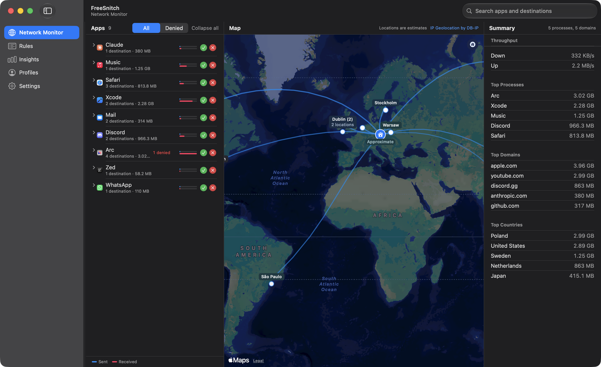

  

  <a href="../README.md">English</a> |
  <b>العربية</b> |
  <a href="README.es.md">Español</a> |
  <a href="README.ja.md">日本語</a> |
  <a href="README.zh-Hans.md">简体中文</a> |
  <a href="README.zh-Hant.md">繁體中文</a>

<h1 align="center">FreeSnitch</h1>

  <b>اعرف مع من يتحدث جهازك. واحجب ما لا تثق به.</b> 
  جدار حماية مفتوح المصدر للتطبيقات على macOS. مجاني، بدون اشتراك، بدون تتبع، بدون إعلانات.

## التثبيت

نزّل ملف `.dmg` الموقّع والموثّق من [صفحة الإصدارات](https://github.com/isaaclins/freesnitch/releases/latest) واسحب FreeSnitch إلى مجلد `/Applications`. يتطلب macOS 13 أو أحدث (Apple Silicon أو Intel). عند التشغيل الأول، اسمح للمساعد في **إعدادات النظام > عام > عناصر تسجيل الدخول والامتدادات**، ثم اسمح بامتداد النظام عندما يطلب macOS ذلك. التعليمات الكاملة في [README الإنجليزي](../README.md#install).

## لماذا FreeSnitch

Little Snitch هو المعيار الذهبي لجدار الحماية على نظام macOS، لكنه يكلّف 59 دولارًا لكل جهاز. LuLu مجاني لكنه يفتقر إلى الخريطة العالمية ومدير القواعد المتقدم. جدار الحماية المدمج في macOS يحجب الاتصالات الواردة فقط ولا يفعل شيئًا للاتصالات الصادرة.

FreeSnitch يقدّم الخيار الرابع:

- **نفس واجهة Little Snitch 6** - عنصر شريط القوائم، خريطة العالم، مدير القواعد، تنبيهات الاتصالات.
- **مفتوح المصدر بترخيص MIT** - اقرأ الكود، عدّله، شاركه.
- **بدون تتبع** - لا تحليلات، لا تقارير أعطال ترسل إلى الخارج.
- **مبني محليًا باستخدام SwiftUI** - تطبيق Mac حقيقي، ليس نسخة منقولة.
- **موقّع وموثّق من Apple** - بدون تحذيرات Gatekeeper.

## المميزات

- مراقب شبكة بخريطة عالمية لكل اتصال نشط مع تصنيف العمليات والنطاقات والدول
- مدير قواعد كامل بأسلوب Little Snitch مع المجموعات والقوائم السوداء
- DNS over HTTPS إلى Cloudflare أو Quad9 أو Google أو أي خدمة DoH تختارها
- وكيل DNS محلي على `127.0.0.1:53` يعترض كل استعلام
- حجب على مستوى النطاقات عبر قوائم 1Hosts و OISD و StevenBlack و HaGeZi
- حجب على مستوى عناوين IP والمنافذ عبر مرساة `pfctl`
- ملفات تعريف (افتراضي، منزل، واي فاي عام، إغلاق محكم) تتبدّل تلقائيًا مع تغيّر الشبكة

## الملف الكامل بالإنجليزية

[README.md](../README.md)
